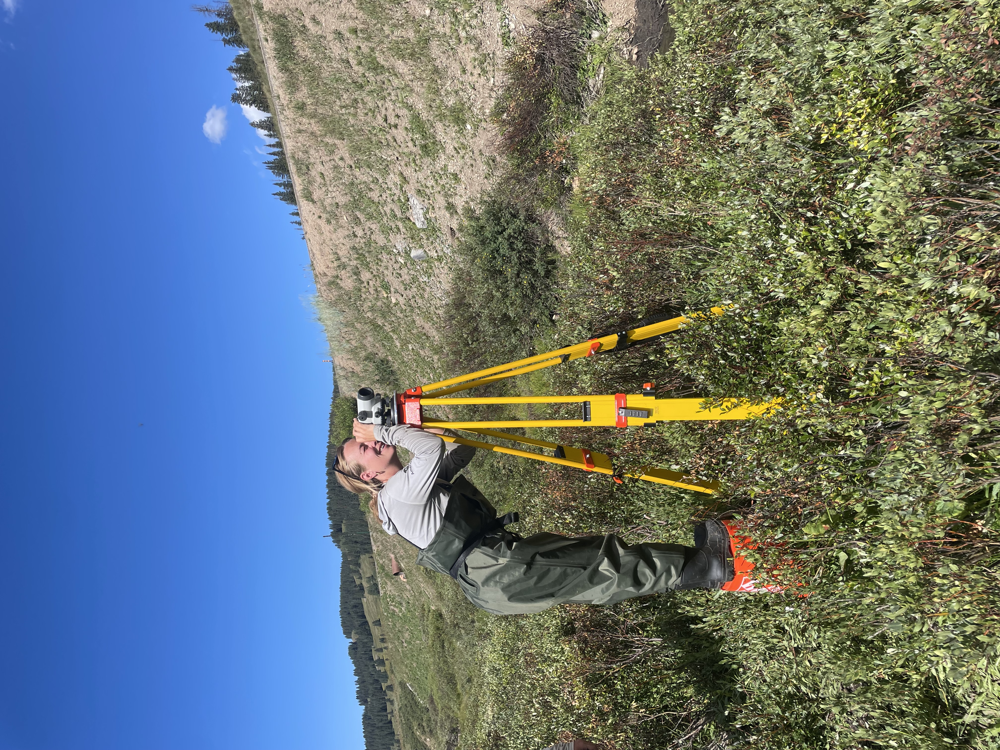

### Greta Binzen
Conservation Professional with background in environmental science and mathematics based in Durango, CO. 

#### Contact Info
+ (978) 930-8220
+ greta.binzen@gmail.com
+ [github.com/gretabinzen](https://github.com/gretabinzen)
+ [LinkedIn](https://www.linkedin.com/in/greta-binzen-6a8188130/)

#### Bio
Hi there! I currently live in Durango, CO where I work for Southwest Conservation Corps (SCC) as a Program Coordinator. In my current role I support our conservation crews to do meaningful project work throughout the Four Corners. Prior to SCC I worked for the Forest Service and before that as a seasonal crew member doing invasive species removal and wilderness stewardship. My academic background is in Environmental Sciences and Mathematics and I bring the two fields together whenever possible. I grew up in a small town in Vermont and am always seeking new places to get outside and explore. 

#### Education
Skidmore College. 
Bachelor of Arts, Environmental Studies. 
Minor in Mathematics. 
Graduation Date: May 2019. 

#### Publications
+ Wildlife population trends as indicators of protected area effectiveness in northern Tanzania (published in Journal of Ecological Indicators, Vol 110)
+ Managing Sustainable Tourism in New York’s Adirondack Park: A Case Study of Public Perceptions and Preferences for Reducing the Impacts of Recreation in the High Peaks Wilderness Complex (published in the Journal of Park and Recreation Administration)

#### My First Map
Here is a map of the High Peaks Wilderness in Adirondacks State Park.

<embed type="text/html" src="img/highpeakswilderness.html" width="600" height="600">

