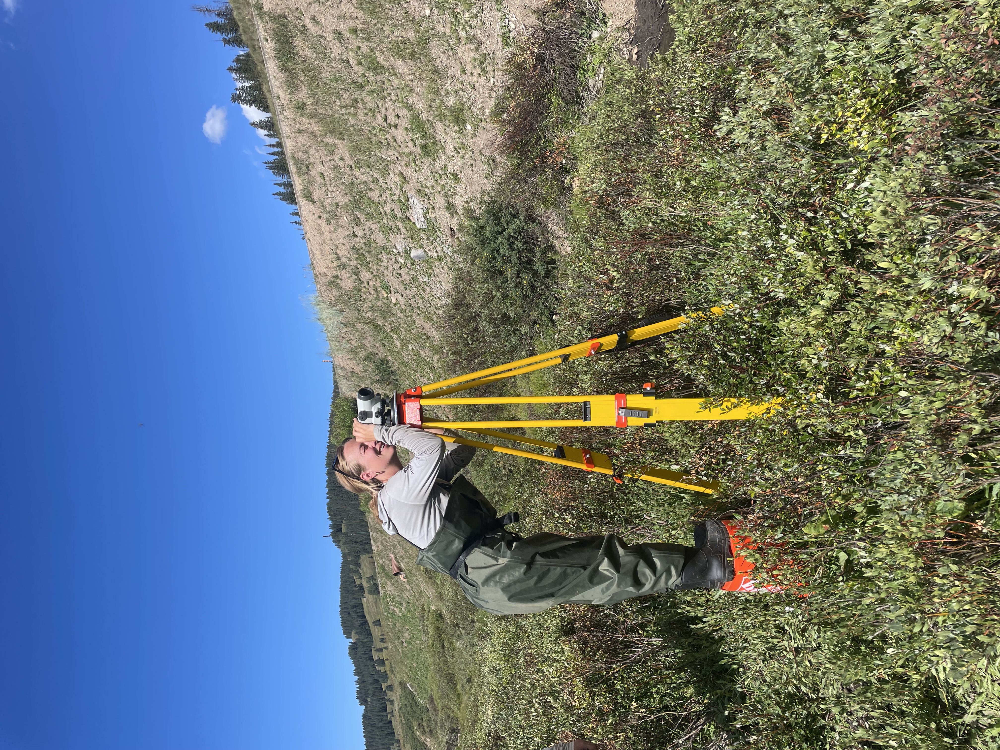

### Greta Binzen
Conservation Professional with background in environmental science and mathematics based in Durango, CO. 

#### Contact Info
+ (978) 930-8220
+ greta.binzen@gmail.com
+ [github.com/gretabinzen](https://github.com/gretabinzen)
+ [LinkedIn](https://www.linkedin.com/in/greta-binzen-6a8188130/)

#### Bio
Hi there! I currently live in Durango, CO where I work for Southwest Conservation Corps (SCC) as a Program Coordinator. In my current role I support our conservation crews to do meaningful project work throughout the Four Corners. Prior to SCC I worked for the Forest Service and before that as a seasonal crew member doing invasive species removal and wilderness stewardship. My academic background is in Environmental Sciences and Mathematics and I bring the two fields together whenever possible. I grew up in a small town in Vermont and am always seeking new places to get outside and explore. 

#### Education
Skidmore College. 
Bachelor of Arts, Environmental Studies. 
Minor in Mathematics. 
Graduation Date: May 2019. 

#### Publications
+ Wildlife population trends as indicators of protected area effectiveness in northern Tanzania (published in Journal of Ecological Indicators, Vol 110)
+ Managing Sustainable Tourism in New York’s Adirondack Park: A Case Study of Public Perceptions and Preferences for Reducing the Impacts of Recreation in the High Peaks Wilderness Complex (published in the Journal of Park and Recreation Administration)

#### Climate Coding Assignment
**Temperature Data in Montpelier, VT shows Climate Warming over the past 60 years**

In this assignment I analyzed temperature data from Montpelier, VT from the year 1960 through 2020. I was able to fit a trend line to the data which showed an overall increase in the temperature in Montpelier and indicated the climate has changed over time. Based off of this assignment, I found an increase of .025 degrees celcius per year. This roughly translate to a 2.5 degree fahrenheit increase over those 60 years which is aligned with the Vermont Climate Assessment which was published in 2021 and found a 2 degree increase statewide from 1900 to 2020 (Clark, Crossett, 2021). I chose to use the OLS regression because the data is normally distributed and behaves linearly over time. It is important to note however that the OLS regression cannot take into account other weather patterns that may impact temperature overtime. I feel that fitting the trend line is a helpful visual tool however as I've already mentioned I did not test for statistical significance.

Bibliography
Clark, M., Crossett, C., 2021. Climate Change in Vermont. In Galford, G.L., Faulkner, J. et al. (Eds), The Vermont Climate Assessment 2021. Burlington, Vermont: Gund Institute for Environment at the University of Vermont.

#### My First Map
Here is a map of the High Peaks Wilderness in Adirondacks State Park.

<embed type="text/html" src="img/highpeakswilderness.html" width="600" height="600">

